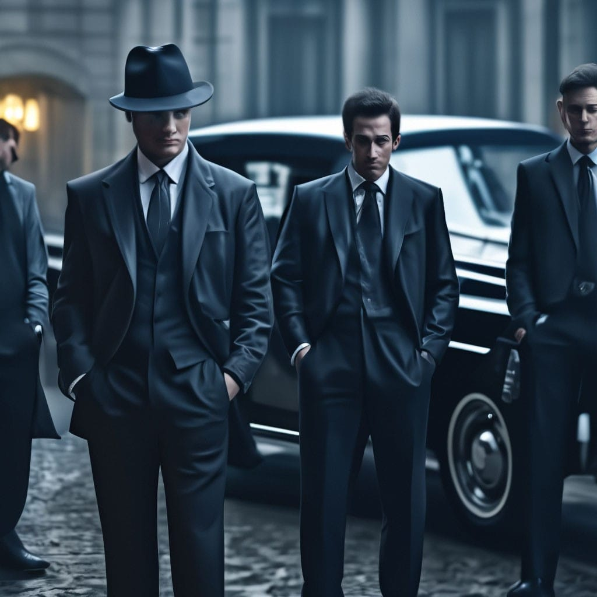
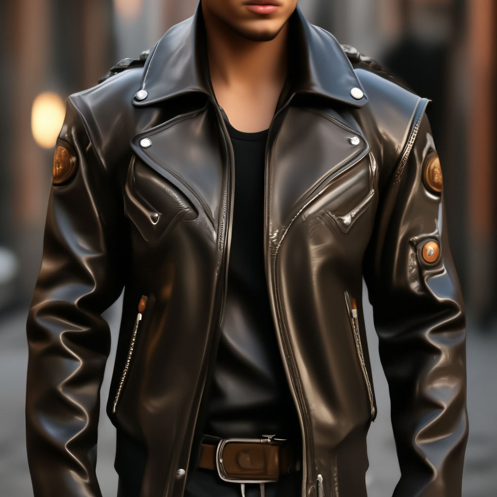
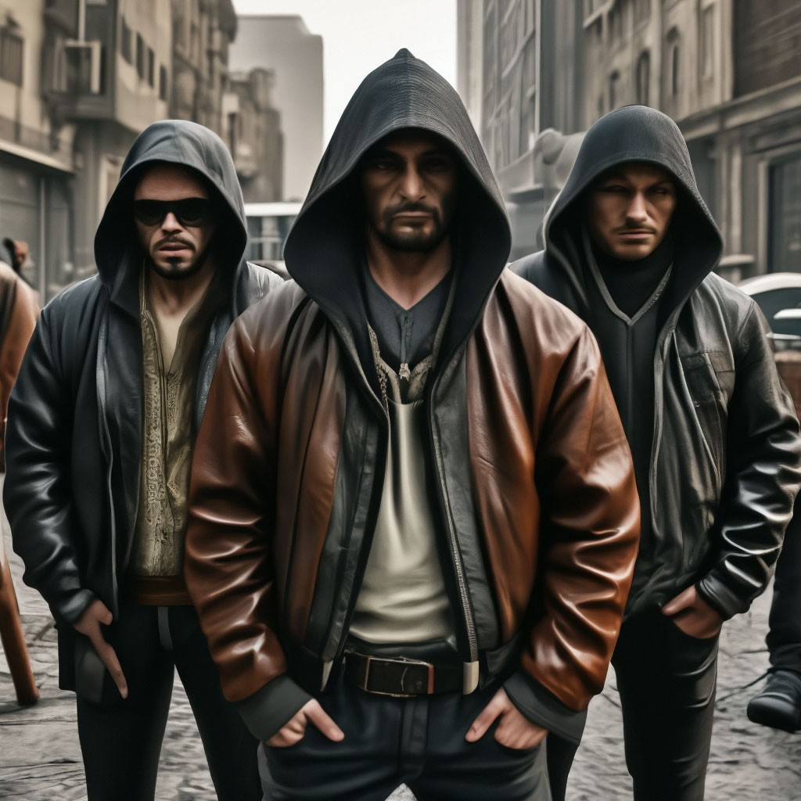
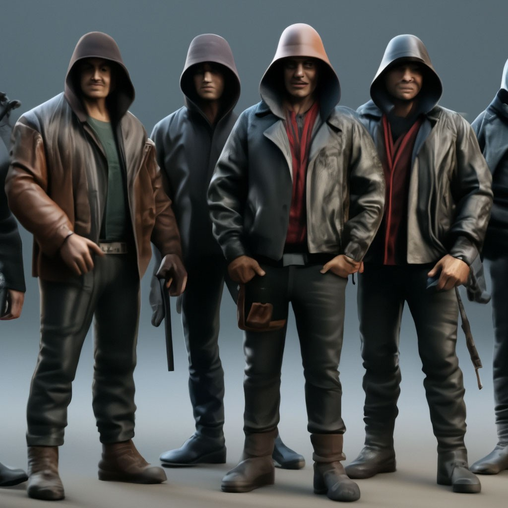

<html lang="en">
<head>
    <meta charset="UTF-8">
    <meta http-equiv="X-UA-Compatible" content="IE=edge">
    <meta name="viewport" content="width=device-width, initial-scale=1.0">
    <title>Пример страницы с кнопками</title>
    
</head>
<body>

    <audio id="backgroundMusic" autoplay loop>
        <source src="Бригада.mp3" type="audio/mp3">
        Ваш браузер не поддерживает воспроизведение аудио.
      </audio>
      <button id="toggleButton">Эпичная фоновая музыка</button>

     
    <h1>Мафия</h1>
    
Ваша задача стать самым главным авторитетом. 
        Для достижения этой цели вам надо выбирать правильные ответы.
        Будьте смелыми и уверенным, сохраняйте спокойствие 
        и тогда вы достигните своей цели

    <button class="button" onclick="changeContent('page33')">Начать игру</button>

</body>
</html>
